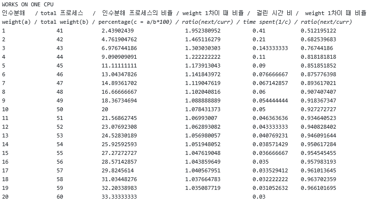
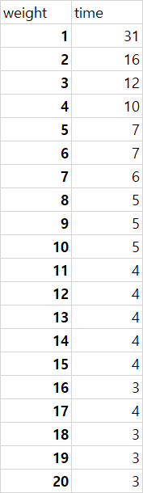

# os-team4
OS Spring Team4
## Project 3

### How to build our kernel
* project 기본 build 방법으로 하시면 됩니다.
* 또는 `./onetime.sh`를 실행해도 됩니다. 이렇게 하면 build 후에 image 파일이 생성되고 압축되는 과정까지 완료됩니다.

### High-level design and implementation
#### System call registration
* `kernel/sched/core.c`에 두 system call `sched_setweight`, `sched_getweight`를 정의하고, 시스템 콜 등록 과정을 따라 등록하였습니다.

* `sched_setweight`
  * 인자로 프로세스 `pid`와 바꿀 `weight`를 받습니다. 
  * 주어진 `weight`는 1 이상 20 이하여야 합니다. 그렇지 않으면 `-1`을 반환합니다.
  * 만약 주어진 `pid`가 0이면 이 시스템 콜을 호출한 프로세스(task)를 다룹니다.
  * 주어진 `pid`의 task가 존재하지 않으면 `-EINVAL`을 반환합니다.
  * 해당 task의 scheduling policy가 WRR이 아니면 `-1`을 반환합니다.
  * root 유저 또는 해당 프로세스를 소유한 유저만 호출할 수 있습니다. 그렇지 않으면 `-EPERM`을 반환합니다.
  * root가 아닌 유저는 `weight`를 올릴 수 없으며, 올리려고 하면 `-EPERM`을 반환합니다.
  * 실행에 문제가 없으면 해당 task의 `weight`를 변경합니다. 만약 해당 task가 현재 돌아가는 task가 아니라면 해당 task에 할당되는 `time_slice` 길이도 변경합니다.
  * 실행에 문제가 있어 중간에 반환할 때, lock을 잡고 있는 상태이면 lock을 놓습니다.

* `sched_getweight`
  * 만약 주어진 `pid`가 0이면 이 시스템 콜을 호출한 프로세스(task)를 다룹니다.
  * 주어진 `pid`의 task가 존재하지 않으면 `-EINVAL`을 반환합니다.
  * 해당 task의 scheduling policy가 WRR이 아니면 `-1`을 반환합니다.
  * 실행에 문제가 없으면 해당 task의 `weight`를 반환합니다.
  * 실행에 문제가 있어 중간에 반환할 때, lock을 잡고 있는 상태이면 lock을 놓습니다.

#### Add a new scheduling policy
> Weighted Round Robin(WRR)

* `include/uapi/linux/sched.h`
  * `SCHED_WRR`의 값을 7로 하여 정의

* `tools/include/uapi/linux/sched.h`
  * `SCHED_WRR`의 값을 7로 하여 정의

* `include/linux/sched.h`
  * `sched_wrr_entity` 구조체 정의
  * `task_struct` 안에 `struct sched_wrr_entity` 타입의 멤버 변수 정의

* `kernel/sched/core.c`
  * task의 `sched_wrr_entity` 초기화 (`__sched_fork` 함수에서)
  * task의 policy가 `SCHED_WRR`이면 `wrr_sched_class`를 사용하도록 함 (`sched_fork` 함수에서)
  * 설정할 scheduler의 policy가 `SCHED_WRR`이면 `wrr_sched_class`를 사용하도록 함 (`__setscheduler` 함수에서)
  * `sched_init_smp` 함수에서 `init_sched_wrr_class` 함수를 호출하도록 함
  * `sched_init` 함수에서 `init_wrr_rq` 함수를 호출하도록 함

* `kernel/sched/rt.c`
  * RT scheduler보다 우선순위가 낮은 바로 다음 scheduler가 WRR scheduler가 되도록 설정

* `kernel/sched/sched.h`
  * WRR도 `valid_policy` 중 하나로 인정되도록 함
  * `wrr_rq` 구조체 정의
  * `rq` 구조체 안에 `struct wrr_rq` 타입의 멤버 변수 정의

* `kernel/sched/wrr.c`
  * `struct sched_class` 타입의 `wrr_sched_class` 정의
    * WRR scheduler보다 우선순위가 낮은 바로 다음 scheduler가 fair(CFS) scheduler가 되도록 설정
    * 각종 함수 포인터의 값 설정 및 해당 함수 구현
  * run queue를 초기화하는 `init_wrr_rq` 함수 정의
  * `init_sched_wrr_class` 함수 정의

#### Necessary functions in WRR
> `kernel/sched/wrr.c`에 구현

* `enqueue_task_wrr`
  * 해당 task를 run queue에서 제거한 후, 이 task를 run queue 맨 뒤에 추가

* `dequeue_task_wrr`
  * 해당 task를 run queue에서 제거

* `pick_next_task_wrr`
  * run queue의 다음 task를 반환

* `task_tick_wrr`
  * *round robin을 수행하는 함수*
  * 인자로 주어진 task의 policy가 WRR가 아니면 반환
  * 이 함수가 호출될 때마다 해당 task의 `time_slice`를 1씩 감소시킴
  * 만약 해당 task의 `time_slice`가 0이면
    * `time_slice`를 `weight * 10ms`로 설정
    * 해당 task가 run queue에 혼자 들어 있으면 round robin을 수행할 필요가 없으므로 반환
    * 해당 task가 run queue에 혼자 들어 있지 않으면 이 task를 run queue의 맨 뒤로 옮기고 해당 run queue의 맨 앞의 task를 수행하도록 함

* `update_curr_wrr`
  * 현재 run queue 안에서 수행되고 있는 task의 수행 시간 등 통계량 업데이트

* `get_rr_interval_wrr`
  * 인자로 주어진 `task`의 policy가 WRR이면 이 `task`에 할당된 timeslice 길이를 반환

#### Load balancing
* `kernel/sched/core.c`
  * `scheduler_tick` 함수에서 `load_balance_wrr` 함수를 호출하도록 함

* `kernel/sched/wrr.c`
  * `load_balance_wrr` 함수
    * 다음 load balance가 일어나는 시간이 되지 않았으면 반환
    * load balance를 수행하기 전에, 네 CPU의 run queue에 대해 다음 load balance가 일어나는 시간(현재로부터 2초 후)을 계산
    * online 상태인 CPU들의 각 run queue 안에 들어 있는 `sched_wrr_entity`들의 weight 합을 계산해, 가장 weight 합이 큰 run queue와 가장 weight 합이 작은 run queue를 찾음
    * 만약 위에서 찾은 두 run queue의 weight 합 차이(`diff`)가 2보다 크면, weight 합이 가장 큰 run queue 안에 들어 있는, 현재 실행 중이지 않고 `weight`가 `(diff+1)/2`보다 작은 task들 중에서 가장 `weight`가 큰 task를 찾음
    * 만약 위에서 적절한 task를 찾으면, 해당 task를 weight 합이 가장 작은 run queue로 migrate함

#### Synchronization
* `task_struct`를 읽어야 할 때 `rcu_read_lock`과 `rcu_read_unlock` 사용
* `sched_setweight` 시스템 콜에서 `task_struct`에 값을 쓸 때 `write_lock(&tasklist_lock)`과 unlock 사용
* `weight`가 변경될 때, load balance가 수행될 때, round robin이 수행될 때, enqueue가 수행될 때, 그리고 dequeue가 수행될 때 `raw_spin_lock(&wrr_lock)`과 unlock 사용
* deadlock이 발생하지 않도록 신중하게 lock을 사용하여 구현함

### Investigation
* **TODO** 테스트 프로그램에 대한 설명
* **TODO** 다음에서 요구하는 내용 작성:
You should provide a complete set of results that show all your tests. If there are any results that do not yield execution time proportional to weights, explain why. Your results and any explanations should be put in the README.md file in the project branch of your team's repository. Your plot should be named plot.pdf and should be put next to the README.md file.

### Lessons learned
* 기존에 kernel에서 돌아가던 scheduler인 RT(real-time)와 fair(CFS)의 코드를 읽고, 새 scheduler인 WRR을 구현하기 위해 어떤 함수가 반드시 구현되어야 하는지, 구현하지 않아도 되는 함수는 무엇인지 고민해 보았습니다.
* 새 scheduler를 추가하려면 무엇을 해야 하는지 알게 되었습니다.
* round robin이 어떻게 동작하는지 이해하고 직접 구현해 보았습니다.
* load balance가 어떻게 동작하는지 이해하고 직접 구현해 보았습니다.
* round robin이나 load balance가 수행되는 도중에 해당 task를 수정하는 경우가 없도록 잘 synchronize하기 위해 많은 고민을 하였습니다.
* WRR로 돌아가던 task가 fork를 수행할 경우, 자식 task도 WRR로 돌아가도록 구현하였습니다.
* 최소 하나 이상의 CPU에서 WRR로 돌아가는 task가 없도록 해야 하는 이유를 알았습니다. WRR이 fair(CFS)보다 높은 우선순위를 가지기 때문에 WRR로 돌아가는 task가 하나라도 있으면 그 CPU에서는 fair로 돌아가야 할 task가 절대로 수행되지 않습니다. 이 때문에 모든 CPU에서 WRR로 돌아가는 task가 있는 경우, kernel thread 중 fair로 돌아가야 할 thread들이 starvation을 겪게 되고 시스템이 다운되는 것입니다.
* 유저에 따라 실행 권한을 다르게 부여하는 방법을 알았습니다.
* `pr_err`를 이용하여 상태를 출력하게 한 덕분에 디버깅이 훨씬 수월해졌습니다.
* QEMU를 설치하고 어떻게 사용해야 하는지 익혔습니다. QEMU를 사용하지 않고 직접 기기에 kernel을 올려서 테스트했다면 시간이 매우 오래 걸렸을 것입니다.

#Analysis

- 사전분석:

    
     
#Result

- 결과:

    
